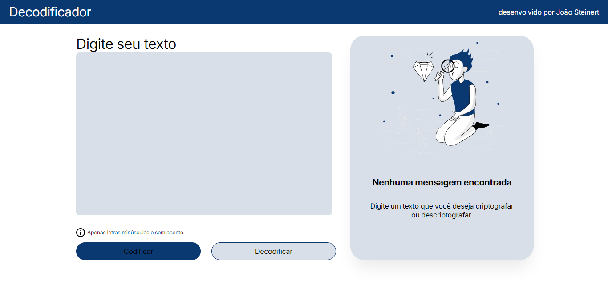

# Decodificador de Texto

Este projeto é uma aplicação responsiva que permite criptografar e descriptografar textos que utiliza um mapeamento específico de letras, e foi desenvolvido como a conclusão da Segunda Fase do programa [Alura One](https://www.oracle.com/br/education/oracle-next-education/).

## Estrutura de Codificação

As seguintes substituições são realizadas durante a codificação:
- `a` → `ai`
- `e` → `enter`
- `i` → `imes`
- `o` → `ober`
- `u` → `ufat`

E as substituições inversas são realizadas durante a decodificação.

### Exemplo:
- Gato → Gaitober
- Oracle → Oraiclenter
## Tecnologias

